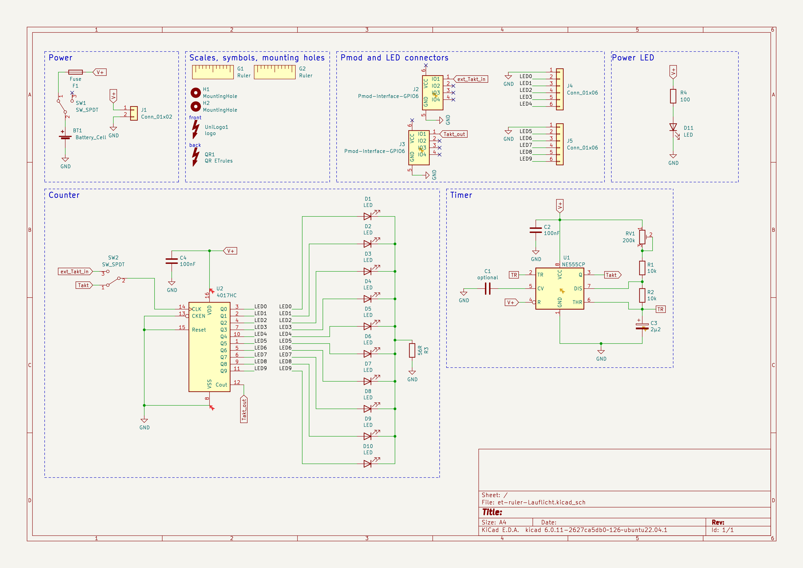
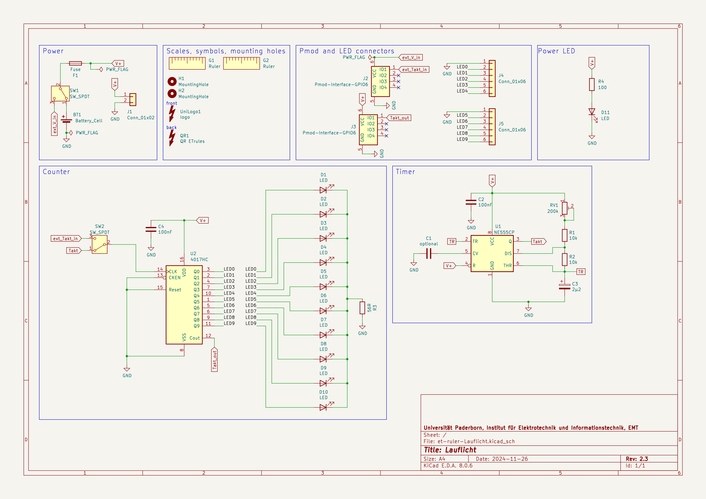

# Lauflicht

This PCB not only comes with a handy ruler, it also can be equiped with a few low-cost electronics to form a "Lauflicht"!
A counter IC (4017HC) is used to count the number of signal edges at its input and presents the result by lighting up an LED.
After counting to ten it starts at one again.
The input signal can either come from an adjustable Timer IC (NE555) or from another "Lauflicht".
Just connect your "Lauflicht" to your friends/siblings/parents "Lauflicht" and voilà!
Your plain, boring count-to-ten "Lauflicht" just became the count-to-100 "Lauflicht" they told you not to worry about.

An interactive html BOM file with pcb layout and material placement can be found [here](bom/ibom.html).

# Schematic

# Interactive BOM
An interactive html BOM page with pcb layout and material placement can be found [here](emtpb.github.io/et-ruler-lauflicht/bom/ibom.html).
